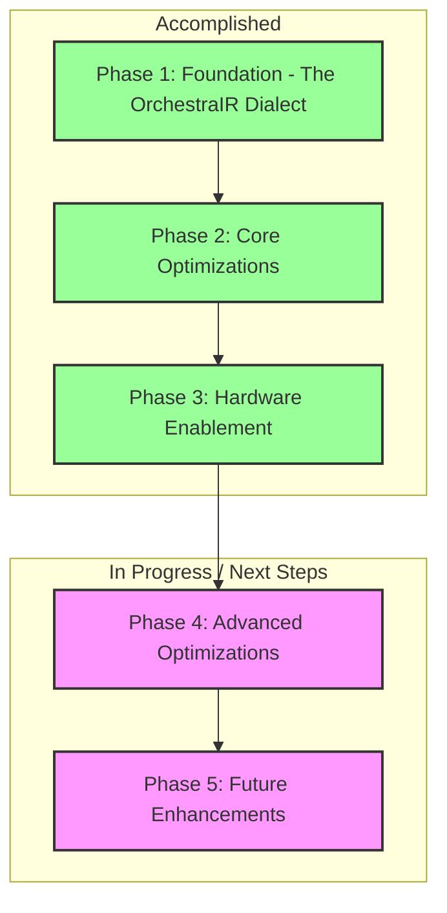

# Orchestra Compiler: Progress Report

**To:** The CEO, Orchestra Company  
**From:** The Engineering Team  
**Date:** August 21, 2025  
**Subject:** Project Status: From Blueprint to Reality

## Executive Summary

This report outlines the significant progress made on the Orchestra compiler, our company's core technology. We have successfully translated the architectural blueprint into a functional, high-performance compiler. The foundational elements are in place, and we are now able to automatically optimize and prepare AI programs to run efficiently on a variety of hardware, including GPUs from different vendors. This is a major milestone that validates our core technical strategy and positions us for leadership in the AI hardware acceleration market.

## Key Accomplishments

We have successfully implemented the foundational components of the Orchestra compiler. Here’s what that means in simple terms:

*   **We have a new language for describing our AI workloads:** We’ve created a proprietary "language" called OrchestraIR. This is the heart of our compiler. It allows us to represent AI programs in a way that our tools can understand and optimize. Think of it as the musical score for our orchestra of hardware.

*   **We can automatically optimize for complex decisions:** Our compiler can now take a standard AI program and intelligently rewrite it to be more efficient. One of the key features we've implemented is "speculative execution," which cleverly handles decision-making (if/then/else statements) in parallel, significantly speeding up programs on GPUs.

*   **We support multiple hardware platforms:** We have successfully built the "translators" that convert our OrchestraIR language into instructions that both NVIDIA and Intel GPUs can understand. This is a critical achievement, as it allows us to be hardware-agnostic and support a wider range of customers.

*   **The compiler is a solid, working tool:** We have a robust testing framework in place to ensure that all the pieces of the compiler work together correctly. The compiler is not just a plan; it's a buildable, working piece of software that is already demonstrating its value.

## Progress at a Glance

The following diagram illustrates the major phases of our implementation plan and our progress to date.

## Next Steps

With the foundation securely in place, we are now moving on to the next phase of development, which will focus on more advanced, hardware-aware optimizations. This includes:

*   **Operator Fusion:** A technique to combine multiple simple AI operations into a single, more complex one, which reduces overhead and improves performance.
*   **Feedback-Driven Optimization:** A "smart" system where the compiler learns from the actual performance of a program and uses that data to make even better optimization decisions in the future.

These next steps will further enhance the performance and intelligence of our compiler, widening our competitive advantage. We are on track with our roadmap and are confident in our ability to deliver on the full vision of the OrchestraOS platform.
