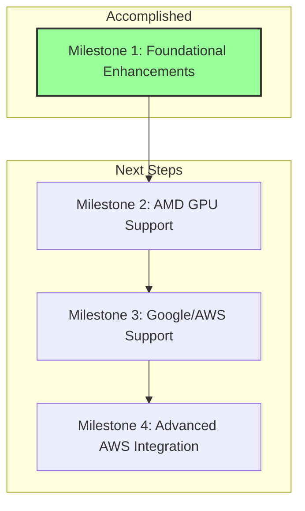

# Orchestra Compiler: Progress Report

**To:** The CEO, Orchestra Company  
**From:** The Engineering Team  
**Date:** August 26, 2025  
**Subject:** Project Status: Foundation Stable, New Development Phase Beginning

## Executive Summary

This report outlines the development status of the Orchestra compiler. We have successfully established a stable, buildable, and verifiable foundation, validating our core architectural strategy. The compiler's core language (`OrchestraIR`) is functional, and all existing tests pass. With this foundation secure, the project is now entering a new, crucial phase of development focused on executing the multi-vendor hardware support strategy, with a clear roadmap for adding comprehensive support for AMD, Google, and AWS accelerators.

## Key Accomplishments

*   **A Modern, Robust Core Dialect:** The heart of our compiler, `OrchestraIR`, is not just implemented but has been modernized. Key operations like `orchestra.task` now use a type-safe C++ API, making the compiler more robust and easier to maintain. This serves as an effective workaround for a known issue in our MLIR dependency, ensuring development can proceed without being blocked.

*   **A Flexible, Two-Pronged Optimization Framework:** We have implemented two powerful optimization paradigms:
    1.  **Static Mitigation:** The `--divergence-to-speculation` pass automatically rewrites conditional logic to be more efficient on GPUs.
    2.  **Declarative Optimization:** The `transform-interpreter` is now integrated, allowing performance engineers to write optimization strategies (like operator fusion) in simple scripts without needing to recompile the entire compiler. A successful fusion test is already operational.

*   **Verified Multi-Vendor Lowering Paths:** We have established the foundational pipelines for targeting multiple hardware vendors, with varying levels of maturity:
    *   **NVIDIA (Mature):** We have end-to-end support for lowering to NVIDIA GPUs, including the latest asynchronous data movement features for both Blackwell (TMA) and Hopper architectures.
    *   **AMD (Initial Support):** We can successfully lower data movement operations for AMD GPUs. The next step is to enable matrix acceleration.
    *   **Intel (Incomplete):** The lowering path for Intel GPUs is not yet functional, and its tests are currently disabled pending further development.

## Development Roadmap at a Glance

Our progress and next steps are best visualized by our formal development milestones.

## Next Steps & Strategic Outlook

With the foundational compiler in place, our immediate focus shifts to broadening our hardware support, which is the core of our "meta-OS" vision. The next steps are organized into two critical milestones:

1.  **Complete AMD GPU Support (Milestone 2):** The next major task is to implement the `linalg-to-rock` lowering pass. This will integrate our compiler with AMD's `rocMLIR` kernel generator, unlocking high-performance matrix acceleration on AMD Instinct GPUs and bringing our support for AMD to the same level as NVIDIA.

2.  **Unlock Hyperscaler Platforms (Milestone 3):** The highest strategic priority is the implementation of the "StableHLO Bridge." As detailed in the architectural blueprint, this is the essential gateway to supporting Google TPUs and AWS Trainium accelerators. Completing this milestone will allow us to target every major AI hardware platform, fully realizing the compiler's vision as a truly heterogeneous orchestration engine.

We are on track with our roadmap and are now focused on executing these next critical phases of the project.